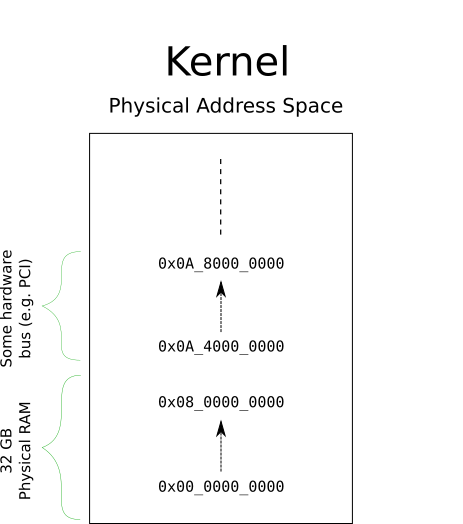
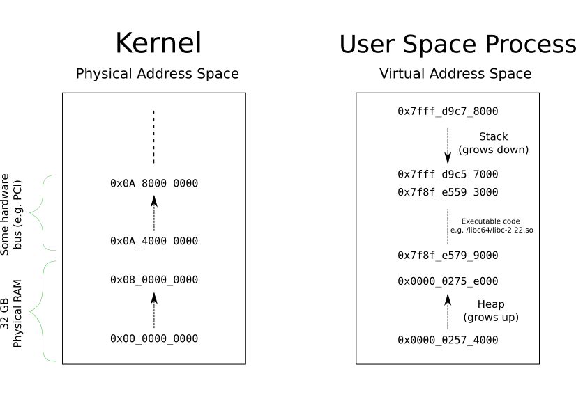
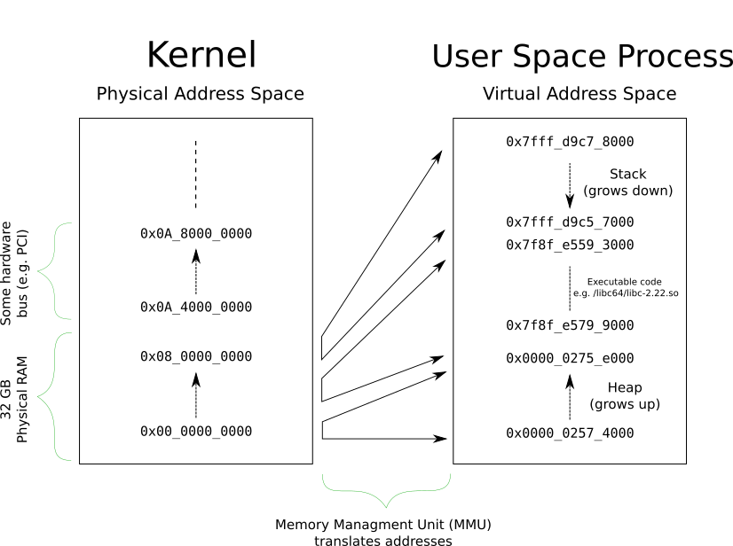
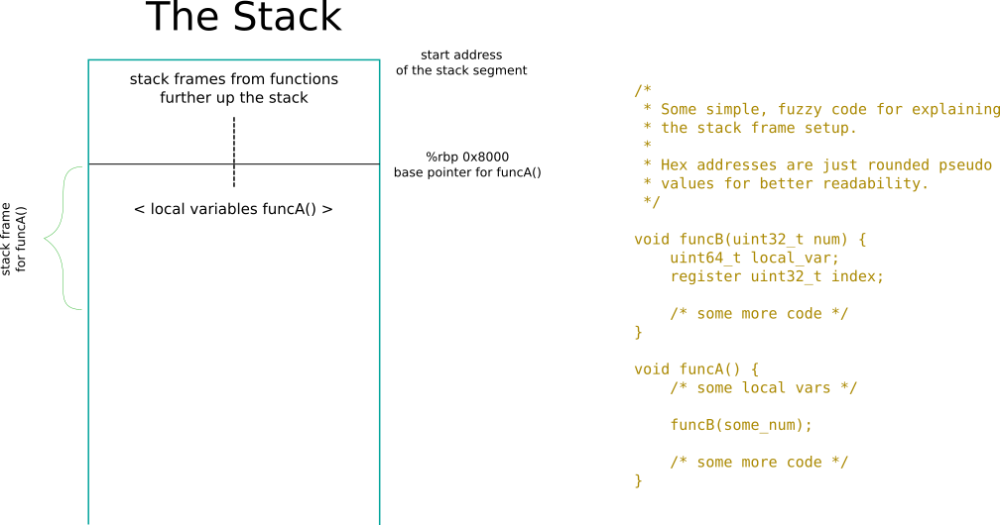
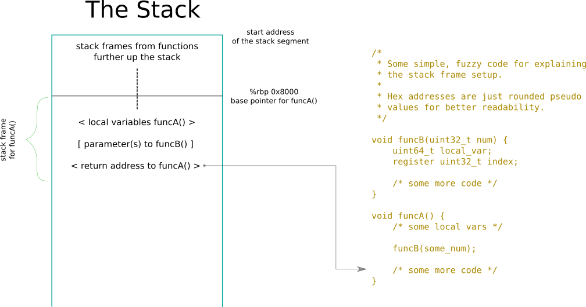
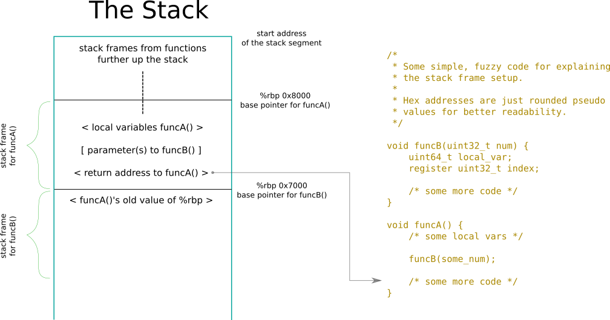
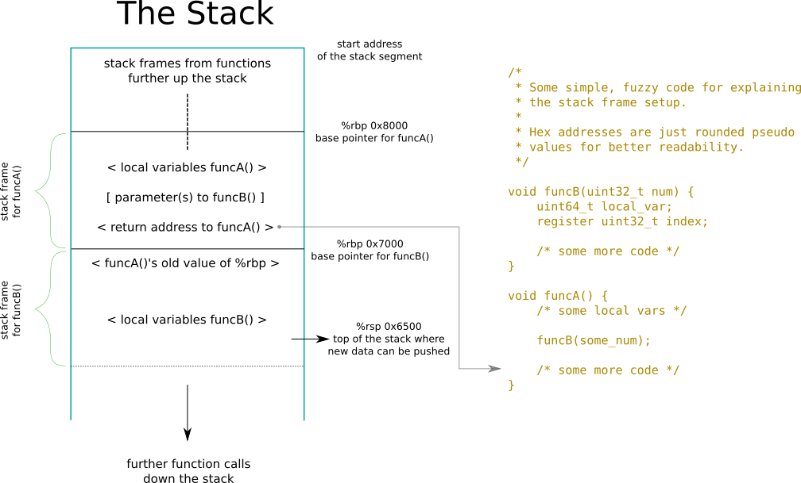
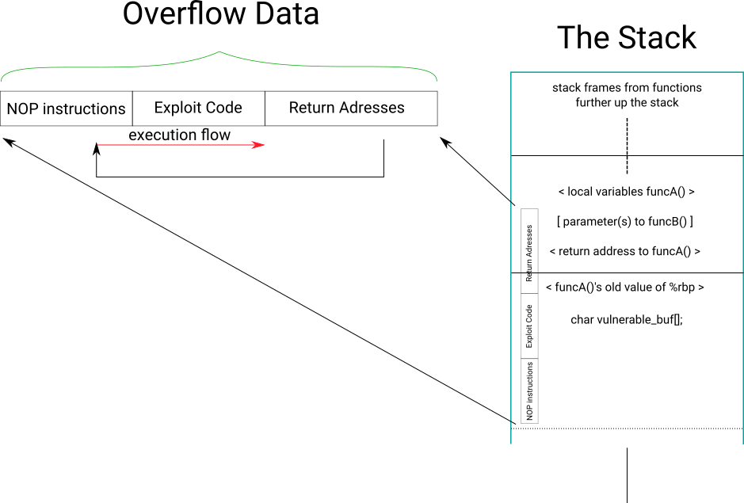
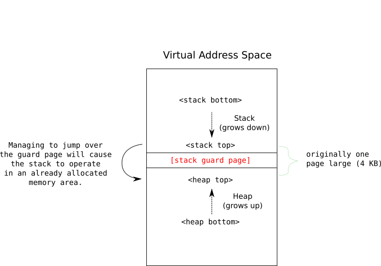

Training: Anatomy of Buffer Overflows and Low Level Security
============================================================
:author:	Matthias Gerstner - Security Engineer - SUSE Security Team
:backend:	slidy
:max-width:	95%
:data-uri:
:icons:
:homepage:	http://www.suse.com/security

About the SUSE Security Team
----------------------------

=== Where to find us

[role="incremental"]
* Find us on our website http://www.suse.com/security
* Contact us on our mailing list at security@suse.de
* On our internal IRC in `#security`
* On Slack in `#discuss-security`
* Or me personally at matthias.gerstner@suse.de
* Or sometimes also in person in the office.

About the SUSE Security Team
----------------------------

=== What we do - reactive security

[role="incremental"]
* Monitoring upstream software for security reports / fixes.
* Assessing the severity of security issues.
* Taking care of the security / maintenance update process:
[role="incremental"]
** Requesting security updates from package maintainers.
** Reviewing security update submissions in OBS.
** Communicating with customers and users about security concerns in SUSE
   products.
** Managing embargoed security issues.

About the SUSE Security Team
----------------------------

=== What we do - proactive security

[role="incremental"]
* We do security oriented reviews of new products/packages, or new versions
  thereof.
* We are managing whitelisting restrictions of security sensitive components
  and features in OBS and IBS and perform reviews of these components.
* We are communicating best practices in secure software development, try to
  raise awareness in general.
* We are supporting other teams with security related frameworks like SELinux,
  AppArmor and others.
* Red Team Exercises: Testing our own IT infrastructure.
* "Hiring" of Security Champions in other teams.

About the SUSE Security Team
----------------------------

=== What we don't do

[role="incremental"]
* Security Certifications (FIPS, CC, etc.). This is now handled by the
  separate certifications team.
* IT security (Infra, corporate IT). We do support in some areas but we are
  not formally responsible.

About Me
--------

=== What I do

[role="incremental"]
* I am maintainer of trusted computing related packages:
** tpm related packages ('tpm-tools', 'trousers', 'tpm2-0-tss', 'tboot', ...)
* I mainly conduct code reviews of e.g. new D-Bus services, setuid programs,
  PAM modules and other security relevant changes.
* I am sometimes checking security bugfixes in updates, communicate with
  upstream, provide security improvements.
* I investigate major security issues discussed in the community.
* At times I evaluate new security features (e.g. kernel security frameworks)
* If nothing else is requested from us then I do *truly* proactive reviews of
  interesting components e.g. network services, security sensitive features in
  the distro.

About Me
--------

=== My Experience

[role="incremental"]
* 10 years experience as a Software developer and architect in embedded and
  security focused areas.
* For nearly 7 years now in the security review business.
* Mostly system programming in `C` and `C++`.
* Cross platform development Windows/Linux/QNX.
* Linux experience for about 20 years.

Talk to us!
-----------

Don't hesitate to contact us if you have any questions or need advice about
security topics.

We'd like to check on things with you *before* they're finished and released.
Security should be considered from the very beginning, not as an afterthought.

About this Training
-------------------

[role="incremental"]
* In this training we will thoroughly investigate one of the most widespread
  and most dangerous classes of security issues: buffer overflows.
* We will have a look at the different dangers that come with these flaws and
how to exploit them.
* We do this by putting ourselves in the role of an attacker. This way we can
  better understand the needs of secure development practices.
* This training is supposed to be hands-on and to provide practical guidance for
  the everyday work as a programmer. Interleaved with the theory we will talk
  about, we will be looking at and experimenting with practical examples.

Structure of the Training
-------------------------

[role="incremental"]
* Day 1
[role="incremental"]
** Introduction to debugging with 'gdb': We will use it later to construct exploits.
** Introduction to Assembler programming.
** Basic understanding of address space layout, memory management, stack
   management.
* Day 2
[role="incremental"]
** Finishing the Assembler/memory management introduction.
** Construction of typical stack buffer overflow exploits.
** Hands-On examples for us to try out the real things and experiment.
* Day 3
[role="incremental"]
** A fully-fledged example of arbitrary code execution in production software.
** Some less obvious types of stack programming errors and vulnerabilities.
* Day 4
[role="incremental"]
** Modern protection mechanisms against common types of exploits.
** Dangers that still remain even with todays protection technology.
** A look onto heap buffer overflow issues.

Prerequisites
-------------

[role="incremental"]
* General understanding of C programming.
* General understanding of Linux.
* The topics can be difficult to grasp at times:
[role="incremental"]
** Because of all the low level details and new concepts...
** I'd like to everybody understand the basic principles.
** Please tell me if you're lagging behind so I can repeat or explain from a
   different angle.
* There's a number of hands-on examples we will discuss and you can
experiment with them on your own during and after the training:
[role="incremental"]
** You will need a computer running openSUSE or similar Linux.
** The instructions in the examples have been tested on openSUSE Tumbleweed
   and on Leap 15.4
** You need to have installed a suitable development environment (`zypper install -t pattern
devel_C_C++`) and GDB (`zypper install gdb`).
** And some extra packages that will be mentioned as we encounter them.

Why Even Bother about this "old school" Low Level Stuff?
--------------------------------------------------------

There is an ongoing shift in educational content for engineers and in the daily
work of many computer scientists. The C programming language as the
predominant one in the Linux ecosystem is slowly fading and is being replaced
by safer and more abstract ones like Rust or Golang. Classical buffer
overflows are no major concern there anymore. Why should we even bother to
understand the "old" low level stuff?

[role="incremental"]
* A lot of existing C programs will continue to accompany us probably for more
  decades to come so some people will have to deal with it the one way or the
  other.
* The new programming languages are not better on all levels. If it is about
  low footprint and full control classical C or C++ might still be viable
  candidates to use even for new projects. Or for the modern programming
  environments themselves to be created.
* The reality on the lower levels of computing doesn't change even if we use
  modern programming languages. Understanding the principles of how the
  computer and the operating system work usually make you a better programmer,
  Admin etc. even if you don't act on this level in your everyday work.

An Introduction to 'gdb'
------------------------

[role="incremental"]
* The GNU debugger 'gdb' is the standard debugger for Linux and also for
  other UNIX like operating systems.
* It is an interactive console program that understands a variety of
  *compiled* programming languages (basically all the languages supported
  by the GNU compiler suite).
* So what does it do?
[role="incremental"]
** It can start new programs directly in the debugger.
** It can attach to already running programs.
** It can match source code locations to the binary machine code the program
   is currently running.
** It can stop the program when it reaches a certain code location
   (breakpoints).
** When stopped you can inspect the program state i.e. variable contents,
   addresses, the call stack and a lot more.
** You can also modify parts of the program while it is running or call
   functions to some extent.
* There also exist graphical frontends to 'gdb' of varying quality that are
  supposed to ease its use (e.g. 'ddd', 'kdbg', 'nemiver'). But knowing the ropes
  on the command line is always useful and efficient so that's why we
  concentrate on that. The command line doesn't need any extra setup, is also
  easily available remotely via SSH and provides the full feature set that 'gdb'
  offers.
* 'gdb' also supports a basic terminal based UI called 'tui' that is an
  integral part of the command line program.

An Introduction to 'gdb'
------------------------

This introduction to 'gdb' will cover more than what is strictly needed for
the scope of this training. But we still need to keep it resonably short for
being able to cover all the other topics we have.

Preparations for Debugging a C/C++ based Program: Debug Symbols
---------------------------------------------------------------

[role="incremental"]
* To make any sense of a binary program 'gdb' needs the _debug
  symbols_ associated with it.
* These symbols basically define which identifiers (e.g. function and variable
  names) exist, what their types are and where they can be found in the
  executable and therefore in program memory.
* Because these symbols are rather large (a lot of additional strings) they're
  not kept in the final binary program installed on a Linux distribution.
  They're _stripped_ off the binary.
* When actively developing a program then you can simply pass the `-g` switch
  to 'gcc' or 'g++' to have it generate debug symbols and store them in the
  resulting binary.
* When trying to debug an existing program from the Linux distribution then
  you will need to install a separate _debuginfo_ package that contains the
  debug symbols for each binary of a package in a separate file.
* The debug symbols always need to exactly match the binary to be debugged.
  Even if you compile the same source code twice, the resulting debug symbols
  aren't usually fully compatible with each other. It is difficult to
  identically reproduce a binary program (e.g. due to timestamps).
* Debug symbols can include a checksum to detect mismatches between binary
  and debug symbols.
* Side note: There is an effort to achieve `reproducible builds` of programs
  which also allows to verify the correctness and trustworthiness of the
  binaries in a distribution independently.

Preparations for Debugging a C/C++ based Program: Debug Source
--------------------------------------------------------------

[role="incremental"]
* For the debugger to be able to display the current location in the source
  code that matches the current program state it needs to have the original
  source available that was used to compile the binary.
* The paths to the source code are also encoded in the debug symbol
  information. 'gdb' will try to lookup the source code in the file system
  based on this information.
* Similarly to the _debuginfo_ packages there exist _debugsource_ packages
  that contain just the source code of the original package.
* Using the `directory <dir>` command of gdb you can also specify one or more
  additional directories where 'gdb' will look for the source files.
* It is possible to use 'gdb' without having the source files around. This
  still allows to see for example the backtrace of a program.
* More recent versions of 'gdb' on openSUSE Tumbleweed now offer a mechanism to
  automatically download required debug symbols from a remote server. These
  debug symbols are then stored in the home directory of the calling user.
* It can still make sense to explicitly install debuginfo packages to avoid
  duplication when debugging is done on different user accounts, or to avoid
  (possibly slow, or error prone) network accesses while debugging.

In Practice: Setting up the Debug Environment and Invoking 'gdb'
----------------------------------------------------------------

* We will learn how to debug a small test program and also how to debug an
  existing program in the distribution.
* *Hands-on*: see example folder 'gdb_intro'.

General `gdb` Shell Behaviour
-----------------------------

[role="incremental"]
* The `gdb` shell uses a concept to look for a matching prefix of a command
  and accepts it if it is unique. For example `r`, `ru` and `run` are all
  recognized as the `run` command.
* You can use tab completion like in the `bash` shell to complete commands and
  get a list of supported commands.
* The `help` command can be used for a simple online documentation of existing
  commands.

Basic `gdb` Commands: Controlling the Program Flow
--------------------------------------------------

[role="incremental",width="75%",options="header",align="center"]
|====================================================
^|Command           ^| Description
|r[un] [parameters] | Starts the current program from the beginning, optionally passing parameters
|start [parameters] | Like `run` but automatically stops the program in `main()`
|q[uit]             | Exit the debugger
|b[reak] [location] | Insert a breakpoint where to stop program execution either at the current location,  based on a function name (`b main`) or a source code location (`b gdbtest.c:10`)
|info br[eakpoints] | Shows currently active breakpoints
|enable [number]    | Enable a breakpoint
|disable [number]   | Disable a breakpoint
|delete [number]    | Remove a breakpoint
|c[ontinue] [count] | Continue program execution until a stop event occurs, optionally skipping a breakpoint `count` times.
|n[ext] [count]     | Continue execution until the next source code line
|s[tep] [count]     | Like `next` but if a function is executed, enter it (step-in)
|u[ntil] [location] | Continue *past* the current line or (e.g. to skip loops)
|====================================================

Basic `gdb` Commands: Inspecting the Program Data
-------------------------------------------------

[role="incremental",width="75%",options="header",align="center"]
|====================================================
^|Command            ^| Description
|backtrace +
bt| Shows the current function call stack
|select <frame>     | Select a certain stack frame as numbered in the backtrace
|info threads       | Shows the threads belonging to the program
|p[rint] [/fmt] <identifier> | Print the value of a variable, constant or function address. `/fmt` can be things like `/x` to display numbers in hexadecimal.
|x [/fmt] <address> | Display memory ranges according to `/fmt` which follows the syntax `/<count><type>` e.g. `/10c` will print ten ASCII character bytes.
|info registers     | Display processor registers
|info locals        | Shows all local variables in the current function context
|l[ist] <identifier> | Shows the source code of the current program location or of a certain function or file
|====================================================

`gdb` tui Mode: ncurses Based Windowing
---------------------------------------

[role="incremental",width="75%",options="header",align="center"]
* You can start gdb directly in tui mode like this: `gdb -tui [...]`. Or you
  can toggle tui mode by using `ctrl-x` followed by `a`.
* You can navigate between windows by using `ctrl-x` follow by `o`.
* You can change the layout using the `layout` command. E.g. `layout asm`.

Play Around a Bit
-----------------

With the information so far play around a bit with different contexts to get a
feeling for how `gdb` works. I will answer any questions you may have.

More Advanced `gdb` Features
----------------------------

Just to mention them here are some more advanced forms of `gdb` usage:

[role="incremental"]
* You can create hardware watchpoints at certain memory locations to have the
  program stop when a datum is changed. This is useful if in a complex program
  a certain variable is corrupted in ways not well understood.
* Remote debugging: You can start a small program `gdbserver` on a remote
  system and control it from a different machine. Typically used for embedded
  devices but this approach can also be used to debug the Linux kernel running
  in a virtual machine. This can be a bit tricky, the local and remote parts
  need to match version wise, otherwise things can break (in my experience).
* Post-mortem analysis: When a program crashes and creates a core dump then
  the core dump can be analyzed using `gdb` to see which condition lead to the
  program crash.

Common `gdb` Pitfalls
---------------------

[role="incremental"]
* If no checksums are used then `gdb` might use wrong debug symbols for a
  program without noticing, resulting in all kind of chaos in the debugger.
  For system programs this shouldn't happen, because checksums are used.
* The debugger only **roughly** matches source code lines to machine code.
  In complex scenarios `gdb` may not be able to correctly match them.
  Especially with well optimized code the execution flow at times seemingly
  jumps around wildly in the source code, because the compiler reordered
  instructions in the machine code.
* In optimized code the values of certain variables may not be accessible
  anymore (**optimized out**). This can be a difficult situation; sometimes
  changing into a different program context can make the contents visible. In
  the end only a look into the assembler code may make it clear what happened,
  which needs a lot of time investment.

Excursion: Compile vs. Link vs. Runtime
---------------------------------------

[role="incremental"]
* What is __compile time__?
[role="incremental"]
** It is the time when the compiler or assembler processes symbolic code and
   generates machine code for it. In C programming each source file is a
   separate compilation unit from which machine code is generated (object
   files).
** Through static analysis the compiler can find errors during compile time
   and refuse to generate machine code from it. Errors found during compile
   time are "cheap", because the compiler finds the problem for you before
   human debugging needs to happen.
* What is __link time__?
[role="incremental"]
** Link time is when the linking stage of a program in the build procedure is
   reached. For C programming this means that all the generated machine code
   found in object files is merged into an executable program or library. During
   this stage addresses might need to be calculated such that e.g. functions can
   be called correctly. Data is organized in different sections like constant
   data into one section while read/write data in another, code in another and so
   on. Beyond the program itself this also includes any external libraries
   that the program uses.
** Errors found during link time are already somewhat more expensive, consider
   different programmers working together and they have a name clash for a
   function or global variable: They will only find out once all machine code
   is linked together and the linker complains about a duplicate symbol
   definition.
** On Linux with shared libraries there is also "dynamic runtime linking" i.e.
   the symbols will only be really resolved once the program runs. This moves
   the time when issues are detected even further away.
* What is __runtime__?
[role="incremental"]
** Runtime is when an executable program or library actually runs on a given
   system. Errors found during runtime (e.g. segmentation fault or another
   fatal process signal) are already pretty expensive. The program might
   already be deployed by the end user. Debugging and/or logging needs to be
   used to find the cause of the error, a new fixed program or patch has to be 
   provided.
** Even worse are logical errors during runtime i.e. the program does not
   visibly crash but it produces wrong results (e.g. infinite loop, no
   operation at all or corrupted/wrong data is produced).

Stack vs. Heap: Two Different Kinds of Memory Allocation
--------------------------------------------------------

For understanding Assembler and buffer overflows we need a good understanding
of low level memory management. In higher level languages there is only
"memory", in C programming we already have to deal more directly with it but
in Assembler there are a lot of dirty details we usually don't see.

The Heap: Dynamic Memory Allocation
-----------------------------------

[role="incremental"]
* Holds data that is dynamically allocated via `malloc()`,
  `new[]` or similar allocators provided by the programming language.
* Requires quite a complex management by the allocator for not wasting memory
  (fragmentation).
* Can change size of allocations within reasonable limits (e.g. `realloc()`).
* Needs to be explicitly `free()`\'d at least in the 'C' language.
* Typically holds the larger part of the data processed by a program like file
contents, databases etc.
* Can allocate memory for amounts of data not known in advance (e.g. playing a
  video or displaying an image can require all different amounts of memory
  depending on input).
* The actual system call involved is `brk()`. The kernel only hands out a
  single block of memory to the process that needs to be split up by the C
  library or similar memory management routine.

The Stack: Automatic Memory Allocation during Program Flow
----------------------------------------------------------

[role="incremental"]
* Strictly grows and shrinks linearly, by pushing data on top for the current
  function call and popping data after returning from function calls (LIFO -
  last in, first out).
* Can only allocate space for objects of known size during compile time (with
  a few exceptions e.g. stack based dynamic arrays in 'C99' and newer
  standards, or via `alloca()`).
* Objects on the stack cannot change size during runtime.
* The stack only holds local variables for the functions that are currently on
  the call stack. E.g. no globally accessible data is (easily) possible here.
* It is rather limited in size and should only be used for small bits of data
  like loop variables and _small_ buffers. On Linux each thread gets 8
  Megabytes of stack by default, which is already pretty large compared to
  other systems.
* It also holds administrative data concerning the program state for
  entering into / returning from functions.
* This mixture of data storage and administrative data is what makes the
  stack particularly sensitive to security issues (more on this will follow).
* Function local variables in C (`auto` variables) are placed on the stack (or
  in a register).

What does the Address Space of a User Space Application look like?
------------------------------------------------------------------

[role="incremental"]
So what exactly is _User Space_ anyway?

[role="incremental"]
It is the complement to _Kernel Space_. User Space is a term used to denote
regular applications that run under the kernel's supervision, they are the
"users" of the operating system:

[role="incremental"]
* User space applications usually can't directly access hardware and certain
  machine / CPU features. Instead they have to go through the kernel.
* They also only get computation time at the kernel's will (scheduling).
* In contrast kernel threads have arbitrary access to everything in the
  machine and can for example easily crash the complete machine if something
  goes wrong.
* This kind of memory and resource protection is what makes modern
  operating systems much more resilient than (by now) historical operating
  systems like DOS.

What does the Address Space of a User Space Application look like?
------------------------------------------------------------------

[role="incremental"]

What does the Address Space of a User Space Application look like?
------------------------------------------------------------------

What does the Address Space of a User Space Application look like?
------------------------------------------------------------------

[role="incremental"]
* So the memory a userspace process "is seeing" is configurable by software
  (via the MMU) during runtime.
* This allows that each process can access certain data at defined locations
  while the actual memory behind those locations is unique for each process.
  The address `0x2750_e000` can e.g. point to the process's heap for each
  process in the system. So the address is the same but the memory behind it
  is different for each process.
* Note: Even in the kernel, virtual addresses are increasingly used in some
  areas (e.g. `CONFIG_VMAP_STACK`), this figure here is just a basic model.

Looking at the Address Space of a Sample Application
----------------------------------------------------

* Let's examine the different memory reagions in a simple C program.
* *Hands-on*: see example folder 'address_space_basics'

About Processor Bit Width
-------------------------

When we talk about 32-bit or 64-bit CPUs then this is a bit fuzzy sometimes
what it entails.

[role="incremental"]
At the core it refers to the width (word size) of the registers in a CPU:

[role="incremental"]
* 32-Bit CPUs have 32 bits in each register, thus being able to represent
  unsigned numbers of up to 2^32^ - 1.
* 64-Bit CPUs correspondingly can store 64 bits in each register and thus
  unsigned integers of up to 2^64^ - 1.

The Maximum Extent of the Address Space
---------------------------------------

[role="incremental"]
Since registers are also used to hold pointers to memory locations, the width
of the registers also somewhat (but not necessarily directly) relates to the
maximum amount of memory that can be addressed.

[role="incremental"]
On 32-Bit x86 this means that up to 4 Gigabyte of memory can be addressed.
This does not only cover actual RAM but also other hardware devices and
objects that are represented in the address space. There are extensions in
newer 32-Bit processors that allow larger amounts of memory to be addressed
though. Also the 286 processor and some other older processor architectures
support addressing more memory by using different techniques e.g. a view into
different sections (segments) of memory that is controlled via an index that
needs to be managed by the OS and/or applications. Due to backward
compatibility modern AMD64 CPUs still support the modes used for this on an
8086 or 286 processor.

[role="incremental"]
On AMD64 theoretically the large address space of up to 2^64^ - 1 bytes can be
used. Since this is not currently needed in practice, the processors actually
only support up to 48 bits (256 Terabytes) to be used for addressing. The
upper 16 bits always need to be zero, when specifying addresses.

Assembler: Introduction
-----------------------

[role="incremental"]
Soon we want to have a look at the low level details of a program's stack
handling. For this we will require some basic understanding of Assembler. In
this part of the training we will get to know the _basics_ of Assembler - so
far that we can understand how the stack memory management works on the lowest
level.

[role="incremental"]
So what is Assembler exactly?
[role="incremental"]
* It is the thinnest programming layer to write a program. It basically makes
  just the plain CPU instructions more digestible by giving them names,
  instead of just plain numbers (which are actually found in the raw machine
  code).
* The assembler (like a rather simple compiler) translates the assembler
  language into machine code. It performs a couple of sanity checks for each
  instruction to avoid obvious inconsistencies.
* Each assembler instruction directly translates into one machine instruction.
* On assembler level there is no abstraction of the CPU architecture. Thus the
  assembler code needs to be specific to the processor architecture. It looks
  very different for 'arm' compared to 'x86' compared to 'powerpc' etc.
[role="incremental"]
Understanding assembler code is way more difficult than understanding a C
program, because it is much larger than an equivalent C program and much less
descriptive.
[role="incremental"]
With the time we have in this training we can still only scratch the surface
of Assembler programming. You should try to get a feeling for how it works and
what the concepts are. But you don't need to remember each instruction or
register involved.

Assembler: The Basic Registers of the x86 CPU
---------------------------------------------

=== What is a register?

[role="incremental"]
A register is a very small but very fast type of memory that is an integral
part of the CPU. Each register has a designated name and some also have a
special purpose. Most registers can store one "word" i.e. the basic word size
of a processor which is 32-bit for an i386 based CPU and 64-bit for an AMD64
based CPU. Most calculations can only happen in registers so the processor
needs to load data from system memory into registers, operate on it, and
store results back into system memory.

[role="incremental"]
The following table gives an overview of the most important registers on PC
architectures.

// E is for extended, R is - it seems - just for "register"

[role="incremental",width="75%",options="header",align="center"]
|====================================================
^|i386 (32-bit) footnote:[the E prefix is for 'extended'] ^| x86_64 (64-bit) footnote:[the R prefix is for 'register'] ^| Description
|ebp           | rbp             | stack base pointer, where the current stack frame starts
|esp           | rsp             | stack top pointer, here new function local data can be placed
|eip           | rip             | instruction pointer
|eax, ebx, ecx edx | rax, rbx, ... r8 .. r15        | general purpose data
|====================================================

[role="incremental"]
A register does not have a memory address, only its unique name (or number, on
machine code level).

[role="incremental"]
This shows: The stack concept is not only an operating system / programming
language choice but goes even down to the machine instruction and register
set.

Assembler: Register Naming Scheme
---------------------------------

[role="incremental",width="75%",options="header",align="center"]
|====================================================
^|i386 (32-bit) footnote:[the E prefix is for 'extended'] ^| x86_64 (64-bit) footnote:[the R prefix is for 'register'] ^| Description
^|eax           ^| rax             | accumulator
^|ebx           ^| rbx             | base
^|ecx           ^| rcx             | count(er)
^|edx           ^| rdx             | data
^|esi           ^| rsi             | source index
^|edi           ^| rdi             | dest index
|====================================================

[role="incremental"]
The special meaning of these registers is mostly lost today and therefore on
'x86_64' there have just been added general-purpose registers `r8` to `r15`.
In this context the old school registers can be viewed as `r0` to `r7` but
they're still used with their classical names.

[role="incremental"]
`rbp` and `rsp` are the only semantic registers that still serve their
purpose. On 32-bit platforms the GCC switch `-fomit-frame-pointer` is
sometimes used to free the rbp register for performance reasons.

Assembler: Some Basic Instructions
----------------------------------

[role="incremental"]
* An instruction is one elementary command to the CPU to process data found in
  registers and system memory in some way.
* Following are some of the more important assembler instructions necessary
  for understanding the stack handling and later exploit code.

[role="incremental",options="header",align="center"]
|====================================================
^|Instruction              ^| Description
|`mov`                    | move data between two registers/memory locations
|`push`                   | put some data on the stack, advancing %rsp
|`pop`                    | removes some data from the top of the stack, storing it in a register/memory location, reduces %rsp
|`call`                   | continues execution at some other function address, puts the current %rip as return address onto the stack
|`ret`                    | returns to code address stored at the top of the stack, removes it also from the stack by incrementing `%esp`
|`enter`                  | pushes `%ebp` onto the stack, copies %esp into `%ebp`
|`leave`                  | copies `%ebp` to %esp and restores old %ebp from the stack
|`lea`                    | load effective address, computes the address of the offset from a base pointer e.g. for arrays, e.g. `lea rax, [rbx+8]` would put the address of the pointer in rbx plus an offset of 8 into register `%rax`.
|====================================================

// NOTE: hand out individual slides like the register table for better
// understanding on-the-go

Assembler: AT&T Syntax
----------------------

There exist two different Assembler syntaxes for x86 assembler. We are using
'AT&T' syntax while there also exists an 'Intel' syntax. The 'AT&T' syntax is
used in `gdb`, the GNU assembler and other standard Linux utilities. 'Intel'
syntax is more popular in the Windows world. 'AT&T' syntax has the following
basic rules:

[role="incremental"]
* Registers are prefixed with a `%` sign like `%rax`.
* 'immediate' values (constants) are prefixed with a `$` sign like
  `$10`.
* In move operations the transfer source is the first parameter, the transfer
  target is the second: `mov %rbx %rax` will copy the contents of the `rbx`
  register into the `rax` register (think: move from ... to ...).
* Addressing offsets (pointer dereferences) are specified like this: `mov
  -8(%rbp), %rax`. This would
  copy a 64-bit value located eight bytes from the current stack frame into
  `rax`.
* Especially for addressing and pointer handling there exists more complex
  syntax that we won't study in detail here.

Excursion: System Calls
-----------------------

=== What is the difference between a library or function call and a system call?

[role="incremental"]
* A library or local function call is a purely userspace operation, no change
of privilege takes place. Execution jumps from one piece of program code to
another.
* A system call is a request to the operating system kernel (in our case: the
Linux kernel) to perform a certain task on behalf of our program. Practically
all file operations and I/O, starting new programs, networking etc. can only
be accessed by way of the kernel.
* We need to differentiate between system call wrappers, which are function
calls in glibc, and the actual system call. In man pages this is separated in
section 2 like `man 2 exit` for system calls and section 3 like `man 3 exit`
or `man 3p exit` for libc / POSIX library calls. A popular example is `man 2
clone` vs. `man 3p fork`.
* For regular function calls the compiler is free to organize the passing of
parameters any way it wants. Before executing a system call, however, all
necessary parameters for the system call need to be placed into registers in
the correct order, according to documentation (interface contract).
* On i386 Linux a system call is triggered via software interrupt `0x80`.
This approach is still supported on x86_64, but only for 32-bit emulation and
values larger than 32 bits cannot be passed to the kernel this way. So this may
cause strange behaviour if passing large pointers for example.
* On x86_64 Linux a system call is triggered via a dedicated `syscall`
processor instruction.
* During the system call, control is transferred to the kernel and the kernel
code inspects the parameters, whether the requesting process is permitted to
do what it asks for and on success performs the requested operation.
* After the system call is complete any output / return parameters are placed
into registers or userspace memory depending on the system call contract and
control is returned back to the userspace program to continue working.
* Knowing about this is also interesting for performance reasons. System calls
are rather expensive compared to function calls and the amount of them should
be minimized.

Assembler: System Call Conventions
----------------------------------

A quick look onto the conventions for system call parameter passing on 'i386'
and 'x86_64'.

[cols="h,2*",width="75%",options="header",align="center"]
|====================================================
|                        ^| i386        ^|    x86_64
| System Call Instruction | `int 0x80`   |  `syscall`
| System Call Nr. Register| `%eax`       |  `%rax`
| Parameter Registers
                (ordered) | `%ebx, %ecx, %edx, %esi, %edi, %ebp`
                                         | `%rdi, %rsi, %rdx, %r10, %r8, %r9`
| Return Code Register    | `%eax`       |   `%rax`
|====================================================

The system call numbers differ between i386 and x86_64 and can be found in
'/usr/include/asm-x86/unistd_{32,64}.h'.

Assembler: A Hello World Program
---------------------------------

* With what we know so far we will finally write a small standalone assembler
  program.
* *Hands-on*: see example folder 'as_intro'.

Assembler: Register Addressing Modes
------------------------------------

Because of the history of the x86 architecture which started out with 16 bits
on the 8086 and currently is at 64 bits on 'x86_64' - and for easier/more
compact coding - we can access each register with different bit widths.

[role="incremental"]
The following table shows the relation of the differently named registers. 1
.. 8 denote the bytes from low to high order of a single register.

[role="incremental"]
[width="85%",align="center",halign="center",valign="middle"]
|====================================================
|8|7|6|5|4|3|2|1|Comment
8+|*64-Bit*|
8+| `rax, rbx, rcx, ...`| x86_64 only, 'r' for register
4+|                 4+| *32-Bit*|
4+|                 4+| `eax, ebx, ecx, ...`| "extended"
6+|                   2+| *16-Bit*|
6+|                   2+| `ax, bx, cx, ...`| 'x' is historical
6+|                     | *8-Bit* | *8-Bit*|
6+|                     | `ah, bh, ch, ...`    | `al, bl, cl, ...` | high, low
//|ax, bx, ...   | lower 16-bit width part of eax/rax, ebx/rbx etc.
//|ah/al, bh/bl  | high and low 8-bits of the lower 16-bits of eax/rax, ebx/rbx etc.
|====================================================

Assembler: Instruction Width Suffixes
-------------------------------------

Most assembler instructions can operate on different register widths by
appending a suffix. An example for the `mov` instruction, copying the constant
(also called immediate value) zero into the first register.

[width="75%",options="header",align="center"]
|====================================================
|Instruction            | Width
|`movq $0 %rax`         | 64-Bit (__quad__)
|`movl $0 %eax`         | 32-Bit (__long__)
|`movw $0 %ax`          | 16-Bit (__word__)
|`movb $0 %al`          | 8-Bit (__byte__)
|====================================================

[role="incremental"]
When an instruction like `mov` is used without suffix then the Assembler
assumes the full register size. But this is not always unambiguous when e.g.
immediate values are involved, so in those cases an explicit width suffix
needs to be specified.

[role="incremental"]
**Note:** The term "word" can be ambiguous, because on hardware and software
level it has been used in the past referring to the basic register width of the
first processor generation it was designed for. E.g. in the Microsoft WIN32
system programming API a WORD is still 16 bits while a DWORD is 32 bits
("double").

[role="incremental"]
On a more abstract level a processor word is the canonical data width it
is operating with i.e. the width of general purpose registers and thus different
between a 286, 386 and AMD64 processor.

About Processor Architectures
-----------------------------

[role="incremental"]
The following discussion focuses on 'i386' / 'x86_64' architectures. Other
architectures may differ but should basically employ the same concepts. I'll
refer to 32 Bit x86 processors as 'i386' for differentiation, although most
modern 32-Bit Linux distributions are optimized for 'i586' or 'i686' already.

[role="incremental"]
On 32-Bit x86 processors there are only 8 general purpose registers available.
Thus registers are a precious resource and organizing them efficiently was
very important on the PC. This processor architecture has been infamous even
in its infancy for its complexity, other processors (Motorola 68k) already had
up to 16 registers and the upcoming RISC processors starting around the year
1990 (MIPS, Sparc) already had up to 32 registers.

[role="incremental"]
More registers do not necessarily mean everything is better. It also has its
downsides, the processor becomes more complex and context changes (entering
system calls, switching between the execution of different programs) can slow
down.

[role="incremental"]
On 'x86_64' the processor finally has 16 general purpose registers and the
pressure to manage them efficiently is reduced a lot. The complexity
of the 32-bit mode remains but the 64-bit mode is more cleanly organized.

About Functions Calls
---------------------

[role="incremental"]
* What is the purpose of a function in programming languages?
[role="incremental"]
** Separating complex programs into smaller, better manageable pieces.
** Reusing code that would otherwise have to be duplicated.
** Offering clear interfaces for dedicated purposes.
* What needs to be taken care of when a function call happens?
[role="incremental"]
** The input parameters need to be passed to the function's code according to
   a compiler or programming language specific contract.
** The output parameters need to be returned to the caller of the function in
   a similar way after the function execution has finished.
** Certain state of the program / processor before the function call happened
   needs to be saved and restored after the function call has finished.
* What is a call stack?
** It is the series of function calls that are active at a given time at
   program execution. It is what you see when you enter 'bt' in `gdb`.

How is the Stack Organized?
---------------------------

[role="incremental"]
* A function call needs to be generic enough such that it works no matter from
  where in the program and in which program state it is called.
* For each function call that is performed, a _stack frame_ is setup
  that holds all the local variables and possibly input parameters passed to
  the function.
* This also includes additional administrative information required to return
  to the original function correctly.
* Thus a stack frame is a memory area on the stack that belongs to a
  specific function call while it is executing.

Stack Frame Layout and Management
---------------------------------

Stack Frame Layout and Management
---------------------------------

Stack Frame Layout and Management
---------------------------------

Stack Frame Layout and Management
---------------------------------

[role="incremental"]
Note: Remember that the stack memory area grows downwards!

Implementing a Function Call in Assembler
-----------------------------------------

* After this theory on stack handling we'll have a look at how to implement
  our own function call in Assembler.
* *Hands-on*: See example folder 'as_stack'.

Looking at the Stack Frame Disassembly of a Sample Program
----------------------------------------------------------

* We'll examine a practical example with a simple C program.
* *Hands-on*: See example folder 'stack_frame'.

Some Hints Regarding Assembler
------------------------------

[role="incremental"]
* Assembler is __highly CPU and OS specific__ and even differs between i386 /
x86_64, because of differently named instructions, register sizes etc.
* When disassembling code that was compiled with __optimizations__ then it
will be considerably more difficult to understand what is going on, because
the compiler reorders instructions, removes instructions and changes the way
parameters are passed to functions and so on. There are also compiler switches
like `-fomit-frame-pointer`.
* For x86 CPUs there are two different __styles of assembly__ notation called AT&T
and Intel style. One of the main differences is the order in which registers
are written down: AT&T style shows the source register first, Intel style
shows the target register first. On Linux ('gcc', 'gdb') AT&T style is mostly
used.
* Depending on OS, CPU and sometimes also on the compiler different
__calling conventions__ exist. These conventions define in which way
parameters are passed to functions, how the stack frame is organized, what the
caller needs to do and what the callee needs to do.  Sometimes / some parts of
these conventions are defined by the CPU design, sometimes / some parts by
operating system developers etc. If calling conventions don't match
between different functions then trouble is ahead (for example: Microsoft
Windows allows switching between `fastcall` and `stdcall`).
* If functions are declared `static` and are thereby locally defined in a
compilation unit then the compiler can perform more aggressive optimizations,
because it knows of all callers and callees and can make assumptions that
wouldn't be possible if a function is exported e.g. for use in a dynamically
loaded library. This can for example allow to relax the requirements to backup
and restore register contents. A more modern approach is called __link time
optimization__ (lto) that performs optimizations during link time when all
callers from all object files are known (only works for static linking, not
for functions exported by shared libraries).

Typical Stack Overflow Vulnerabilities
--------------------------------------

[role="incremental"]
* What can happen when we overflow a stack-based buffer into the stack frame
  management data?
[role="incremental"]
** Naturally we can crash the program easily by writing bad addresses for
stack pointer, return address, or function specific parameter values.
** More interestingly we can attempt to replace the return address with a
completely different function or code portion and thus achieve completely new
program behaviour.

Working with Binary Snippets: The exit System Call
--------------------------------------------------

* In this example we will learn how to extract a piece of machine code from a
  binary and repurpose it.
* For this example you will need need to install the `execstack` package to
  successfully build it.
* *Hands-on*: this is example folder `exit_snippet`.

Example 1: Parameter Injection
------------------------------

[role="incremental"]
* We'll examine a practical example of a program that doesn't handle its stack
buffer well.
* *Hands-on*: See example folder `param_injection`.
* Can you find the problem?
* What's an easy way to exploit it?

Example 2: Replacing the Return Address
---------------------------------------

[role="incremental"]
* The previous example showed how to modify the parameters that existing code
works with but the basic code flow remained unchanged.
* This time we want to change the code location that is returned to after the
function call finishes.
* *Hands-on*: See example folder `zombie_call`.
* How might we find out the correct location of the return address on
the stack relative to the overflowing buffer, in a black-box approach?
* NOTE: the stack addresses presented when running GDB vary slightly from the
addresses a program uses when running outside of gdb. This is because gdb adds
some environment variables which are not normally there. This shifts addresses
by a couple of bytes. Attaching to a program with gdb after it was normally
started should yield the regular stack addresses.

Trouble with Terminators
------------------------

[role="incremental"]
* Many stack overflows occur in typical unbounded C string functions like
`strcpy()`, `scanf()` or the evil `gets()`.
* What might be a limitation when we're overflowing a stack based buffer in these
cases?
[role="incremental"]
** The problem is when any `'\0'` byte is included in the code or addresses
that we want to execute then it is not copied completely over into the target
buffer.
** The same goes for `'\n'` for line based functions like `gets()`.
** Or any whitespace characters in case of `scanf("%s", ...)`.
* To get around this limitation we might need to rewrite some assembler
statements in a way that avoids the terminating bytes.
* For this the bare CPU instructions need to be checked whether they contain
any of the problematic bytes and look for equivalent command sequences
that avoid having to put the bytes in question into the code sequence.
* Example: replacing __mov $0 %rbx__ by __xorq %rbx %rbx__ avoids any null
bytes but achieves the same result of getting the value of 0 into `%rbx`.

// hint that there have even been concepts like putting the C library into an
// address space that always contained a null byte

Exploiting the Stack Machinery
------------------------------

We've seen how the stack works and that it is a sensitive area when buffer
boundaries are not enforced correctly. To execute arbitrary code we now
need to find ways to exploit the way the stack works to our advantage, using
the available CPU instructions and properties of the vulnerability.

Example 2: The execve System Call
---------------------------------

[role="incremental"]
* What an attacker typically wants to achieve with a stack buffer overflow exploit
is starting some other program with the elevated privileges of the vulnerable program
(think of __setuid__ binaries) or start a reverse shell that accepts additional
commands from the network.
* An important system call in this regard is `execve()`.
* This is a more complex system call that requires string and string-array
parameters for setting it up correctly.
* We need to take some more precautions for constructing a piece of self
contained machine code suitable for overflowing the stack and calling
something like __/bin/sh__ via the `execve()` system call.
* *Hands-on*: We'll look into example folder `exec_snippet` for this.

Finding the Right Return Address
--------------------------------

[role="incremental"]
* We now know how to construct a piece of self-contained code that will do
what we want (calling __/bin/sh__). But how can we cause it to be executed?
* We need to overflow a return address onto the stack that hits exactly the
beginning of our injected code.
* Although we roughly know where the stack starts, we can't be sure. So we'd
need to run many attempts to hit the right address.
* We can help ourselves with a technique known as __NOP slide__:
[role="incremental"]
** A NOP (no operation) instruction is a valid CPU instruction that
effectively does nothing.
** By prepending the actual payload code with extra NOP instructions we get a
range of addresses that are all suitable for finally executing our exploit
code.

Structure of the Overflow Payload
---------------------------------

Setting Arbitrary Code Execution into Motion
--------------------------------------------

* With everything we know now we can try our luck to execute our `execve()`
code in a vulnerable program.
* *Hands-on*: This is example folder `code_injection`.

Real-Life Examples
------------------

We will look into one or two of the following real world vulnerabilities:

[role="incremental"]
=== libsoup (2017)

* A possible remote code execution via http requests
* *Hands-on*: In the example folder `soupstrike` you can find some helper
script and documentation about a real-life stack overflow example that was
found in Gnome's 'libsoup', an http protocol parsing library, some years ago.

[role="incremental"]
=== chocolate-doom (2020)

* A *nearly* possible remote code execution when a network game server accepts
  new clients. It is still interesting for studying.
* *Hands-on*: In the example folder `buffer_doom` you can find some
  helper script and documentation about a real-life stack overflow example
  that was found in the 'doom' OSS port.

[role="incremental"]
=== connman (2021)

* A remote code execution in the DNS reverse proxy component of the connman
  network manager.
* A pretty complex but interesting real-world example of a remote stack buffer
  overflow.
* *Hands-on*: In the example folder `connman_dns` further instructions and helpers
  can be found.

[role="incremental"]
=== htmldoc (2021)

* `htmldoc` is documentation tool to convert HTML to formats like PDF.
* It is an example of badly implemented media format parsing that could be
  used to attack via mail attachments or social engineering.
* *Hands-on*: In the example folder `doc2exploit` further instructions and
  helpers can be found.

[[stack-overread]]
Stack Buffer Overread
---------------------

[role="incremental"]
* So far we've looked at the worst case of a stack buffer write overflow which
might allow an attacker to execute arbitrary code or gain privileges.
* But what if there's a vulnerability that only allows to read content from
the stack? Which types of vulnerabilities do you see here?
* *Hands-on*: See example folder `stack_overread`.
[role="incremental"]
** The exposed information from the stack frame can help finding out where
exactly the stack is located. When combined with a write overflow in some
other code location this can greatly increase our chances of success trying to
exploit the latter.
** It may also expose further addresses of interesting local parameters and
arguments that we might use in exploit code.
** In the worst case, sensitive information on the stack may be exposed, like
cleartext passwords, data read in from root-owned files ...

Undefined Data on the Stack
---------------------------

[role="incremental"]
* In C programming, when a variable is put on the stack and not immediately
  initialized then it contains undefined data (i.e. it is usually not zero
  initialized automatically).
* What this means is that typically some seemingly random or garbage data, or,
  more accurately, data from former stack frames is found in the variables.
* To see what kind of bad things can happen with this let's have another
  *Hands-on*: See example folder `uninitialized_data`.

Not Leaving Sensitive Data Behind: A Difficult Task
---------------------------------------------------

[role="incremental"]
* Initialization of buffers and variables before using them is good practice
and works well in most situations. This protects against accidental leakage of
data from other parts of the program. For small data like integers this is
also no big performance impact. For large buffers special care has to be
taken if performance matters.
* It would generally be desirable to wipe out any critical data like
passwords, cryptographic keys, random data etc. right after it has been used.
* In managed programming languages that use a garbage collector and smart
memory management (Java, Python, ...) it is very difficult to do this, because
the programmer has little knowledge or even control over the way the data is
handled on the lower level.

Not Leaving Sensitive Data Behind in C: A Difficult Task
--------------------------------------------------------

Even in pure C programming there are difficulties:

[role="incremental"]
* Write operations like `memset()` can be optimized out by compilers, leading
to hard to find surprises (see example folder `lost_memset`).
* Data can even be left behind in registers and for example for accelerated
cryptographic operations some rare registers might be used that will not be
typically overwritten by other code (e.g. MMX, SSE extensions).
* The low-level handling implemented by the compiler may cause data to be
swapped in and out of registers, leaving copies of data on the stack without
our knowledge.
* There's `memset_s()` in newer language standards starting from 'C11' and
'C++11' (but in 'C11' it is optional). There's also `explicit_bzero()` (BSD) or
`SecureZeroMemory()` (Microsoft Windows).
* 'gcc' supports `-fno-builtin-memset` to avoid optimizing away the memset()
function call, however this might hit performance for other code locations.
* Generally we're in a fight here against the philosophy of the C programming
language and the optimization routines of compilers. Even if we win for the
moment we can't be sure if we don't lose next time. And this condition is
difficult to detect even in unit tests or alike.
* Actually we'll be needing a kind of language extension for a clean approach.
For today it needs to suffice that we're aware of these issues and do our best
to solve them.

An Optimization Proof memset(): A Best Effort Approach
------------------------------------------------------

For writing a `memset()` wrapper/replacement that is likely not to be
optimized out we can take the following approach:

[role="incremental"]
* Put the function in an isolated compilation unit that is compiled without
optimizations (i.e. `-O0`).
* The parameter pointing to the buffer to be zeroed should have the `volatile`
qualifier.
* This compilation unit should be passed `-fno-builtin-memset` or a similar
option suitable for the target compiler.

Protection Mechanisms Against Stack Overflows: Intro
----------------------------------------------------

* The typical stack overflow vulnerability has been around for many decades and
nowadays a number of protection mechanisms are in place that prevent many
otherwise dreadful security issues.
* In the following slides we will discuss the most common of these
protection techniques.

Protection Mechanisms Against Stack Overflows: Coding
-----------------------------------------------------

=== Most Important Protection: Safe Coding Practices

[role="incremental"]
* When there's no bad code then there's nothing to protect from in the first
place. Thus we shouldn't rely on some magic protection helping us but on our
own coding skills for getting security right.
* The protection mechanisms are only a last resort when things already have
gone downhill.
* Therefore always be prudent in your program:
[role="incremental"]
** Only very carefully and restrictively process untrusted input.
** Strictly check your buffer lengths. Everywhere.
** Always check return codes, even for seemingly unimportant calls. Even safe
functions can be used in unsafe ways.
** Initialize stack and heap data with conservative values (rather fail in a
safe way than succeed in a dangerous way).
** Don't use dangerous functions like `gets()` or `strcpy()` that don't
implement length restrictions.
** Encapsulate repetitive and complex memory management operations in abstract
   functions.
** When you really want to optimize e.g. by leaving larger buffers
   uninitialized or by using dangerous functions then clearly document the
   purpose and the conditions surrounding it.
* Use tools for detecting otherwise not easily visible issues. For example:
[role="incremental"]
** Enable the maximum warning level of the compiler, except for diagnostics
   that might be more noise than value.
** Use `valgrind` to detect invalid memory read/write, undefined data usage,
memory leaks (it is not perfect for stack issues though).
** Test with builds compiled with `-fsanitize=address` which will add
transparent routines to detect memory errors during runtime.
** Use 'American Fuzzy Lop', a fuzzing tool to feed automatically generated
data into your software.
* Integrate such tools into continuous integration test suites, unit test
  suites etc.

Protection Mechanisms Against Stack Overflows: Many Eyes for Review
-------------------------------------------------------------------

When you're working on a sensitive code portion or writing a lot of new
interfacing code then you should have somebody reviewing that code.

Protection Mechanisms Against Stack Overflows: Know your C library functions
----------------------------------------------------------------------------

[role="incremental"]
* You need to carefully read man pages or other applicable documentation about
C library and other library/framework functions.
* If you're unsure, read again. Even experienced programmers need to check up
on basics sometimes.
* When you're implementing buffer handling functions yourself then please
carefully document them so others (and yourself) can know what to expect of
them. Try to model them after well known (and safe) behaviour from standard
functions.
* Beware of false friends: There are functions that look safe but aren't. An
example is the 'strncpy()' function:
[role="incremental"]
** It does take a size parameter, but will not `'\0'` terminate the destination
string if the source string is too long.
** It was actually designed for keeping zero-padded strings of fixed size, not
for safe string copying.
** It is not efficient, because it will zero-pad the complete destination
buffer. For example `strncpy(path, PATH_MAX, src)` will actually write nearly
4 kb of zeroes, even when `src` is a short string.
** A good replacement is `snprintf(target, bytes, "%s", source)`.

Protection Mechanisms Against Stack Overflows: Choice of Language
-----------------------------------------------------------------

If performance and low level system programming are not major requirements
then you're better off using a safer programming language like `python`,
`ruby`, `rust` or `go`:
[role="incremental"]
Since those languages themselves might be implemented in C they can still
suffer from overflow vulnerabilities, but the languages as such usually
enforce bounds checking for you.

[role="incremental"]
If you do have tight performance or system programming requirements then ...

Protection Mechanisms Against Stack Overflows: Choice of Language
-----------------------------------------------------------------

My personal opinion: Try to avoid C programming for userspace programs:

[role="incremental"]
* Memory and string handling simply is a *pain* in plain C.
* Attempts to simplify it like in 'glib' tend to result in inefficiencies,
because strings are copied much (`strdup()`) to avoid having to deal
with ownership.
* C++ makes string handling already way easier and memory management more
automatic by using constructors/destructors and reference counting using
`shared_ptr` and alike.
* Even if you don't use other fancy stuff like templates it is worth
it to make the switch.
* Backward compatibility to C allows interaction with all the low level
libraries and system calls without problems.
* You can still offer a C compatible interface to the outside if you're
writing libraries or alike.
* You might need to avoid or take care about 'libstdc++', however, in some
lean and mean environments (things like 'initrd').

Protection Mechanisms Against Stack Overflows: Choice of Language
-----------------------------------------------------------------

The Rust programming language is currently very popular:

[role="incremental"]
* it has security "built-in", because there are practically no ways to break
  memory management, except if explicitly desired by use of so called unsafe
  functions.
* it makes error handling more or less mandatory.
* it is a compiled, mostly static programming language so it can also generate
  highly optimized code comparable to C.

[role="incremental"]
It also has some downsides in my opinion:

[role="incremental"]
* it doesn't offer all features of classic object-orientation and its
  memory model is rather hard to grasp at first - if you're used to other
  languages.
* it uses only static linking and can result in really fat binaries that have
  tons of third party package code in its belly.
* the native dependency handling (also in Go and some other new languages)
  ease and standardize the development, but this also brings new risks: Each
  dependency can also be a maintenance burden, and suddenly the responsibility
  for using safe third party libraries lies in the hands of countless
  developers instead of in the hands of distributors that specialize on this.

Protection Mechanisms Against Stack Overflows: ASLR
---------------------------------------------------

One approach to make stack buffer overflows much harder to exploit is 'address
space layout randomization (ASLR)':

[role="incremental"]
* When active, memory segments like the stack, heap and code are loaded at
random locations for every start of a program.
* Why does this help against stack overflows?
[role="incremental"]
** We can't guess return addresses into exploit code or C library code
reliably any more.
** Every program instance on every machine uses different addresses, once an
exploit attempt on an address is made, the program typically crashes on
failure. So no reiteration is possible.
** Before ASLR, attackers could inspect typical binaries in use for vulnerable
software, determine stack addresses for them, write an exploit that matches
it and attack all those machines using the exploit. This is no longer possible
with ASLR.

Protection Mechanisms Against Stack Overflows: ASLR II
------------------------------------------------------

Suitable assembler code needs to be generated by the compiler to make full use
of ASLR. This is because the assembler code must not contain hard coded
addresses for stack and code locations any more, but must operate using base
pointers set during runtime.

It is called 'position independent code', because it doesn't matter where in
address space the code is placed, it will still work when run (just like our
`execve` code snippet, incidentally).

[role="incremental"]
* For fully taking advantage of ASLR, library code needs to be compiled
with `-fpic`. Executables need to be compiled with the `-fpie` switch and
linked with `-pie`. Object files compiled with `-fpie` can only be used for
linking executables, not libraries any more.
* *Beware*: If some object files are not compiled the right way, then the
resulting binary might silently not utilize ASLR for the code segment.
* If a binary is not fully position-independent then only parts or none of the
memory segments are loaded at random addresses.
* There is a tool named 'hardening-check' that helps to check hardening
properties of ELF Linux binaries. Run it against an executable and check for
the output row 'Position Independent Executable' to determine whether it will
fully support ASLR.
* You can see ASLR in action by running for example `bash -c 'cat
/proc/$$/maps'`. You can see the addresses of various segments changing for
each run, or not, depending on which parts are using ASLR.
* In SUSE distributions we've enabled PIE executables by default now in
Tumbleweed and LEAP-15/SLE-15. Before that only those packages that explicitly
added correct compiler and linker flags have created PIE executables. There's
also an rpmlint warning now when your package ships non-PIE executables.
* Some newer programming environments like Golang make it more difficult to
  generate PIE binaries by default, because of their special (and still
  somewhat evolving) linking model.

Protection Mechanisms Against Stack Overflows: ASLR III
-------------------------------------------------------

Potential issues with ASLR. Which problems do you see?

[role="incremental"]
* The position independent code requires an additional register for storing
  the base address of e.g. code on some architectures. Thus it can slow down
  programs, which was/is especially true on 'i386' machines (5 - 10 %
  performance loss).
* Some architectures like 'x86_64' provide special instructions or registers
  that make implementing position independent code easy and no performance
  penalty.
* On machines with 32-Bit address spaces like 'i386' the available limited
  address space can make 'guessing' the right addresses easier, while on 64-Bit
  architectures a very large amount of possible segment locations makes ASLR way
  stronger.
* Some exotic software might rely on fixed addresses, because of inline
  assembly code, for example. This software would break (or not compile) when
  running with ASLR.
* Leaking addresses of objects in memory into log files or via information
  leaks like stack overread can give attackers valuable information to counter
  ASLR. The combination of an information leak and a stack overflow would thus
  enable code execution again.
* An attacker should not get the possibility to test many different return
  addresses against a vulnerable program. Thus programs should not restart
  indefinitely after crashing but employ some grace period before restarting
  again. The grsecurity kernel patches offer such a feature on kernel level
  (blocks program start for even a whole minute after it crashed unexpectedly).
* In the past some weaknesses of Linux's ASLR implementation have been
  discussed, e.g. https://www.openwall.com/lists/oss-security/2018/02/27/5.
  There it was outlined that the randomness of the mappings was not really
  *that* random.

Protection Mechanisms Against Stack Overflows: ASLR IV
------------------------------------------------------

Some practical tips:

[role="incremental"]
* Running a program in 'gdb' disables ASLR by default for getting reproducible
addresses between individual runs.
* You can get/set the status in 'gdb' via `info disable-randomization` and
`set disable-randomization [on|off]`.
* For programs running outside of 'gdb' you can disable ASLR (for testing
purposes, for example our exploit examples above) by using the 'setarch' tool
like this:
[role="incremental"]
----
setarch `uname -m` -R /bin/bash
----
[role="incremental"]
* This will give you a bash shell with disabled ASLR. This attribute will be
inherited to child processes.

Protection Mechanisms Against Stack Overflows: NX Bit for Stack and Heap
------------------------------------------------------------------------

Modern processors support memory to be mapped as non-executable. The hardware
support is important for performance of this security feature. Using this
feature, the OS can map memory that does not typically contain executable code
as non-executable (also called NX bit). Another term for this
feature is 'W^X' (writable xor executable i.e. either writable or executable
memory). Both should never be necessary except for exotic software.

[role="incremental"]
The most interesting memory types for this feature to use are the stack and
heap memory regions. The stack is never executed, it just serves as a scratch
area while functions execute, to keep administrative and local data.

[role="incremental"]
Should a program violate the protection settings of a memory region then a
SEGFAULT will occur and program execution terminates (typically).

[role="incremental"]
* Why does it protect against security issues to have this?
* A stack overflow could still take place, but it would not be possible to
return to a stack address for execution.
* Existing code in memory cannot be changed into malicious code.

Protection Mechanisms Against Stack Overflows: NX Bit for Stack and Heap II
---------------------------------------------------------------------------

[role="incremental"]
* You can check for a protected stack mapping in '/proc/$$/maps', there should
not be an 'x' bit for the '[stack]' segment:
[role="incremental"]
----
$ cat /proc/$$/maps | grep -w stack
7ffffffde000-7ffffffff000 rw-p 00000000 00:00 0                          [stack]
----
[role="incremental"]
* There's a package 'execstack' that helps examining and changing whether an
executable stack will be available for a binary:
[role="incremental"]
----
# the '-' minus shows it has no executable stack
$ execstack /usr/bin/ls
- /usr/bin/ls

$ execstack -s /my/binary
# 'X' shows that the binary will get an executable stack
$ execstack /my/binary
X /my/binary
----
[role="incremental"]
* It is a flag in the ELF headers of a binary that indicates to the OS
whether an executable stack is required.
* Some programs may explicitly need an executable stack when they're doing
unusual things (Java virtual machines are likely candidates).
* Some programs (mostly experimental ones) employ self-modifying code which
also conflicts with some of these settings.

Protection Mechanisms Against Stack Overflows: NX Bit for Stack and Heap III
----------------------------------------------------------------------------

The memory protection relies on the hardware support. If it is not available
then we can't make use of it. This especially affects 32-Bit Linux on 'i386'
machines:

[role="incremental"]
* Even though newer 'i386' processors support this in hardware, some
distributions like SUSE don't support the NX bit in their kernels, because
then the kernel would not work on older CPUs like the Pentium MMX, Celeron M
and Pentium M.
* This also affects 32-Bit Linux distributions running on 'x86_64' CPUs in
these cases.
* You can check your kernel log for the following message:
[role="incremental"]
----
$ dmesg | grep NX.*protection
NX (Execute Disable) protection: active
----
[role="incremental"]
* This will show you that from the kernel/hardware side the support is
present.
* There might also be a BIOS setting that influences this.

Protection Mechanisms Against Stack Overflows: Stack Canary Values
------------------------------------------------------------------

Another protection technique is the use of so called canary values on the
stack.

=== So what do we need a canary for?
[role="incremental"]
https://share.america.gov/english-idiom-canary-coal-mine[Explanation for the idiom]

[role="incremental"]
=== How it Works

// disassembly of a stack protected function shows some lines at the end that
// just do the expected thing. It's using thread local storage and the %fs
// segment register, however.
// there seems to be no way of reading this register in gdb.

* The compiler generates extra code that puts a canary value at predefined
locations within a stack frame.
* There are different approaches how the canary value is exactly computed.
* Before returning from a function call some extra check code runs, that tests
whether the canary value is still the expected one, if not then the execution
of the program is aborted.
* How does this help prevent security issues?
[role="incremental"]
** Since the stack buffer overflow almost always relies on some valid target
address on the stack being overflown, the exploit always needs to write *some*
data linearly on the stack until it finally reaches the return address.
** Thus it is bound to overwrite the canary value setup by the compiler.
** The only way around it would be for the exploit to know the correct canary
value to overflow with, which is normally very hard or countered by the
canary value containing typical terminator characters like '\0', '\n', '\r',
or being based on random values chosen during program initialization.

Protection Mechanisms Against Stack Overflows: Stack Canary Values II
---------------------------------------------------------------------

[role="incremental"]
* To enable stack canary values pass one of the following switches to GCC:
[role="incremental"]
** `-fstack-protector` which will enable the extra code only for
functions that put susceptible buffers on the stack (buffers larger than 8
bytes).
** `-fstack-protector-all` which will enable the extra code for each and every
function.
* The protection code introduces some performance penalty especially for
functions that are called very often (e.g. in loops, recursively).
* `-fstack-protector` should be enabled in all cases though, there are little
downsides to this.
* Use `hardening-check` on executables or libraries to check for enabled stack
protection.

Protection Mechanisms Against Stack Overflows: Fortify Source Macro
-------------------------------------------------------------------

The compiler can in some cases transparently fixup well-known function calls
to prevent buffer overflows. This can be done for 'glibc' by passing
the macro definition `-DFORTIFY_SOURCE=3` to the compiler. This needs to be
added to the compiler command line, not into source files, to avoid
inconsistencies.

[role="incremental"]
* Calls to standard functions like `memcpy, mempcpy, memmove, memset, strcpy,
stpcpy, strncpy, strcat, strncat, sprintf, vsprintf, snprintf, vsnprintf` and
`gets` will receive additional security checks as far as this is possible.
* Because often statically sized buffers placed on the stack are used, the
  compiler can even check an unsafe call to strcpy() whether it overflows the
  target buffer.
* This comes at little cost and should be enabled in all cases.
* Use `hardening-check` on executables or libraries to check for enabled
fortify source functionality.
* The level `3` is rather new and supports more cases where the buffer sizes
  are not directly constants.

Remaining Concerns
------------------

[role="incremental"]
* The protection mechanisms presented so far provide a good deal of security
that make successful exploitation of most of the stack buffer overflow
examples we've shown much harder.
* This is true at least for modern machines, not so much for 'i386' processors
as we have discussed above.
* There can still be subtle ways in which buffer overflow vulnerabilities can
cause security problems:
[role="incremental"]
** Even if arbitrary code execution is difficult to achieve, we still have
program abort and thus a denial-of-service on our hands. This can still be
very bad when thinking of a production critical network service for thousands
of users.
** Overwriting existing parameters on the stack can cause interesting results
without requiring knowledge about addresses, overwriting a canary value or
changing the return address. Variations of the 'param_injection' example can
still work even when all protection is in place.
** When internal program state information is leaked via logging, debugging or
separate security issues in a program then parts of the security mechanisms
may be compromised (see also <<stack-overread,Stack Buffer Overread>>).

Remaining Concerns: Return Oriented Programming
-----------------------------------------------

[role="incremental"]
* Return oriented programming is an exploit technique that can bypass 'W^X'
memory protections by simply calling into bits of existing code.
* Existing functions from the affected program and libraries like 'glibc'
contain various instructions that can be carefully tailored towards an
exploit.
* This is an advanced exploit technique but is has been shown that it can be
"turing complete" i.e. the bits of code can be used to derive a fully
functional programming environment.

Remaining Concerns: The Stack Clash
-----------------------------------

[role="incremental"]
* Some years ago a high severity security issue has come to our attention
called "the stack clash" (https://bugzilla.suse.com/show_bug.cgi?id=1037551[bsc#1037551]).
* This is actually a problem that has been known for a decade already but has
not been fixed thoroughly enough in the past.
* This is an issue that occurs when the heap (or other read-write memory
segment) and stack memory areas start to overlap.
* Since the stack starts on an upper memory range in address space and grows
down and the heap starts on a lower memory range in address space and grows
up, there is the possibility that both meet each other when large amounts of
memory are allocated.
* The Linux kernel added a so called stack guard page that is supposed to
detect this situation and abort program execution, when a write to it occurs.
* There have still been possibilities to get past this page when large
uninitialized buffers have been placed on the stack, that didn't cause writes.

Remaining Concerns: The Stack Clash II
--------------------------------------

Remaining Concerns: The Stack Clash III
---------------------------------------

[role="incremental"]
* The stack clash works way easier on 'i386', because the address space is much
smaller there and closing the gap between memory segments is feasible.
* To increase the size of heap and stack different caller controllable
mechanisms can be employed:
[role="incremental"]
** environment variables and command line arguments which will be placed in
the stack segment.
** memory leaks in the program that cause the heap to grow.
* Once two memory regions overlap each other a way needs to be found to either
influence the content found on the stack or the content found on the heap to
influence the execution of the program. This is specific to the attacked
program and the used approach.
* The 'exim' exploit published by Qualys uses the fact that a command line
argument is copied to the heap, which is now actually pointing to the stack,
for triggering a stack overflow.
* This attack is particularly interesting against local setuid root binaries,
because they are started in user context with user arguments and environment
but run with elevated privileges i.e. when we can cause an 'execve()' we'll
get a root shell.
* Since basic assumptions about the program's memory structure are violated in
the stack clash situation, some of the buffer overflow protection mechanisms
may not be effective any more.

Remaining Concerns: The Stack Clash IV
--------------------------------------

So how is this clash fixed? The current fix is multi-fold:

[role="incremental"]
* The stack guard area size has been increased to a larger size and should
also be configurable for administrators to tune it.
* The limits on heap/stack/environment size should be enforced correctly which
was not completely the case.
* A heap memory leak issue in 'glibc' has been fixed that facilitated the
stack clash.
* Compiling programs with '-fstack-check' is supposed to help but 'gcc' was not
correctly implementing this at the time, so it was only a partial fix.

What about the Heap?
--------------------

[role="incremental"]
* So far we've concentrated on exploiting stack based issues.
* What are the security issues with heap buffer overflows?
* How is the heap managed?
[role="incremental"]
** The heap is a separate memory segment that can be extended or decreased
using the `sbrk()` and `brk()` system calls.
** A heap allocator is responsible for managing this memory area for keeping
a large amount of differently sized objects that will be allocated and freed
in seemingly random patterns.
** Equally sized chunks are kept in pools or lists and are chained by keeping
next/prev points in front or back of the chunks.
* Heap issues are generally more difficult to exploit, because the heap is not
part of the regular execution flow in a program.

Heap Buffer Overflows
---------------------

[role="incremental"]
* If the allocator keeps management data at the end of a heap chunk then we
may be able to overwrite this data in a way that causes interesting things to
happen during `free()` time (triggering arbitrary memory writes is an aim
here).
* If the chunk we can overflow is followed by another heap chunk:
[role="incremental"]
** We could manipulate management data of the next heap chunk, in case the
allocator keeps this data at the front of each chunk.
** Otherwise we can manipulate some application specific data.
* If we can overflow into a member of a struct kept on the heap then we might
be able to influence other data in the struct to our advantage.
* The heap allocator's algorithm will differ between 'glibc' versions,
memory management wrappers and programming languages so the exploits cannot be
as generic as with stack buffer overflows.
* On the "plus" side there are less protection mechanisms that apply to heap
buffer overflows.

Heap Memory Leaks
-----------------

[role="incremental"]
* Memory leaks on the heap could be used to obtain a range of addresses for
keeping or duplicating exploit data.
* They also serve a purpose in the stack clash discussed before.

Heap Use After Free
-------------------

[role="incremental"]
* When a part of heap memory is `free()'d` but still used by some part of the
application (use after free) then an attacker can attempt to trigger some new
heap allocation that will be placed just into that memory location.
* Now there live different objects in the application that point to the same
memory. Imagine some "harmless" description text that is stored on the heap.
Some other part of the program now points to that data, assuming some pointers
or other application specific data still lives there. By manipulating the
"harmless" description text the attacker now also controls completely
unrelated data.
* By skillfully constructing the data in the heap buffer it might
be possible to cause unintended program behaviour or even arbitrary code
execution. Each case is individual to the vulnerable application though.

Heap Uninitialized Data
-----------------------

[role="incremental"]
* Similarly to what we've seen for the stack, any new memory obtained via
`malloc()` will contain undefined data.
* This data could cause an information leak if read without initializing the
data.
* In worse cases, decisions may be based on uninitialized data.

Heap Exploit Techniques
-----------------------

[role="incremental"]
* Many principles we've learned from stack buffer overflows will be reused in
exploiting heap buffer overflow vulnerabilities.
* For example the NOP slide can be used in creating better odds when trying to
hit injected data or code. An extended technique is known as 'heap spraying'
where the same data is placed on the heap a lot of times to increase the
amount of valid addresses e.g. for executing code.
* In combination with information leaks can then help determining the correct
address for manipulations to work.

Heap Protection Mechanisms
--------------------------

[role="incremental"]
* The following counter measures also work in the case of heap vulnerabilities:
[role="incremental"]
** Safe coding practices as listed for stack vulnerabilities.
** ASLR also helps here, because the heap is randomly placed into the address
space, too.
** NX bit also applies to the heap, so executing it directly should be
prevented, although there are other techniques like changing the PLT
(Procedure Lookup Table) of the program.
* These are measures that could be taken but depend on the allocator:
[role="incremental"]
** An allocator could attempt not to return recently used chunks again so soon
but that would be another burden on the allocator algorithm.
// TODO: check current malloc()/free()
** There are no general heap canary values as far as I know, although it would
be generally possible to introduce them. There are some additional security
checks in treating the heap metadata in some allocators.
** For example it can be checked whether a heap chunk pointer actually is
within a certain expected memory range.

The End
-------

[role="incremental"]
Hopefully all of you have been able to learn something new in this training
and to better understand how computers work on the lower level, how buffer
management related security issues work and how to prevent them.

[role="incremental"]
On the final slide I am listing a couple of references that I have used for
putting together the knowledge for this training material and that can be used
for diving deeper into some of the topics we have touched.

References
----------

* About clearing buffers and optimized away `memset()` code:
** 'Zeroing buffers is insufficient': http://www.daemonology.net/blog/2014-09-06-zeroing-buffers-is-insufficient.html
** 'std::memset description' (see Notes): http://en.cppreference.com/w/cpp/string/byte/memset
* Tutorial for stack overflow exploitation on i386 32-Bit Linux, on which
parts of this training have been based on:
** 'Smashing The Stack For Fun And Profit': http://insecure.org/stf/smashstack.html
* Wikipedia article regarding return oriented programming:
** https://en.wikipedia.org/wiki/Return-oriented_programming
* An open book offering an introduction to x86 32-Bit assembler programming.
If you want to dive into assembler a bit more this is a good way to go. Parts
of the book are for beginners in programming in general, but the assembler
part is good to understand. For x86_64 assembler you'll need to adjust the
concepts:
** 'Programming from the Ground Up': https://savannah.nongnu.org/projects/pgubook/
